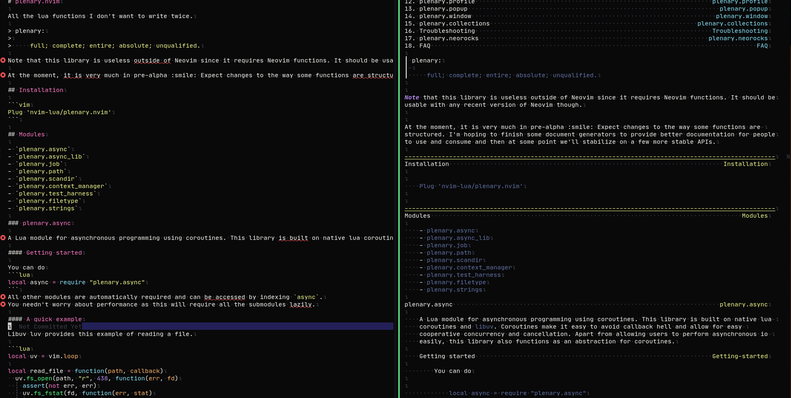

# vimdowner - A markdown to vim help text converter

# Usage
```
vimdowner [OPTIONS...] files...(default: 'README.md')
  -m MODULE NAME  --module-name=MODULE NAME   Name of the library module
  -o FILEPATH     --output-path=FILEPATH      Output of generated docs (default: './doc/')
  -d              --debug                     Print debug info
  -u              --unicode                   Enable Unicode Characters
  -T TEXT         --tagline=TEXT              Tagline of the module
  -l LENGTH       --line-break-length=LENGTH  Length of line breaks (default: 120)
                  --stdout-only               Send output to STDOUT only
                  --no-toc                    Do not add a Table of Contents
```

# Sample
  
